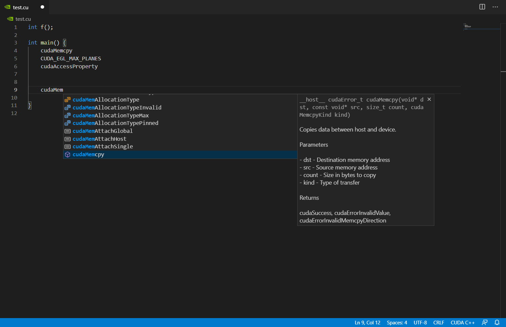
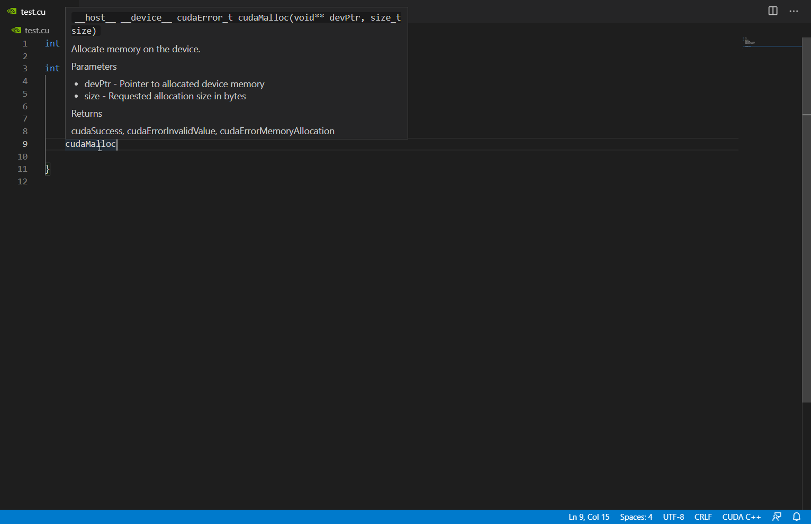
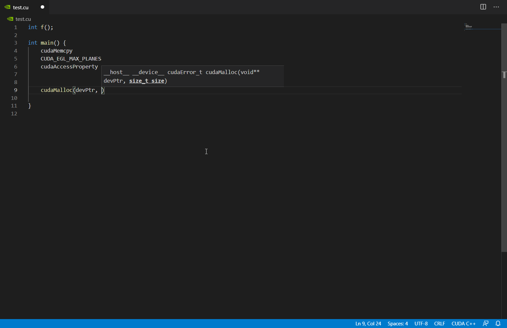

# CUDA extension for Visual Studio Code

A [Visual Studio Code](https://code.visualstudio.com/) [extension](https://marketplace.visualstudio.com/VSCode)
aimed to support working with the [CUDA Runtime API](https://docs.nvidia.com/cuda/cuda-runtime-api/index.html),
including features such as autocomplete, hovering documentation, signature help for function arguments.

## Features

- Autocomplete

- Hovering documentation

- Signature help

